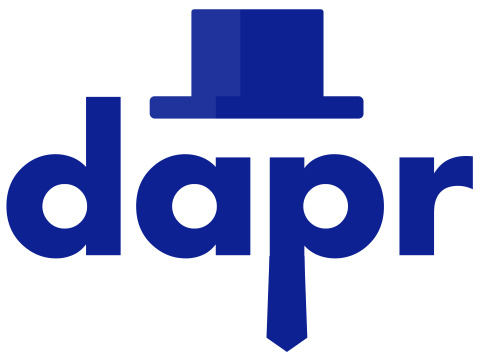

# Learn Dapr 🎩

This repository contains a curated set of resources to learn about, and teach about Dapr.

> *Dapr is a portable, event-driven, runtime for building distributed applications across cloud and edge. It speeds up microservice development by providing a common set of building block APIs that can be invoked directly with HTTP/gRPC or one of the many Dapr client SDKs.*

## 🧑‍🎓 Learn Dapr

Use the following resources to learn about Dapr:

- 🧑‍🎓 [Dapr University by Diagrid](https://www.diagrid.io/dapr-university)
- 📖 [Dapr docs](https://docs.dapr.io/)
- 🏎️ [Dapr quickstarts](https://docs.dapr.io/getting-started/quickstarts/)
- 🧑‍💻 [Dapr Workshop by Diagrid](https://github.com/diagrid-labs/dapr-workshop)
- 🧑‍💻 [Dapr org on GitHub](https://github.com/dapr)
- 🎥[Dapr YouTube channel](http://bit.ly/dapr-youtube)
- 📘 [Dapr for .NET developers (free eBook)](https://learn.microsoft.com/en-us/dotnet/architecture/dapr-for-net-developers/getting-started)

## 🧑‍🏫 Teach Dapr

Use the following resources to teach Dapr:

- 📢 [Dapr presentation decks](https://docs.dapr.io/contributing/presentations/)
- 📖 [Dapr case studies @ CNCF](https://www.cncf.io/case-studies?_sft_lf-project=dapr)
- 🖼️ [Dapr logos @ CNCF](https://github.com/cncf/artwork/blob/master/examples/incubating.md#dapr-logos)
- 🧑‍💻 [Dapr Workshop by Diagrid](https://github.com/diagrid-labs/dapr-workshop)
- 🚦 [Dapr workshop by @EdwinVW](https://github.com/EdwinVW/dapr-workshop)

> Ping [Marc Duiker](https://github.com/marcduiker) on [Dapr Discord](https://bit.ly/dapr-discord) or [LinkedIn](https://www.linkedin.com/in/mduiker/) if you're about to give an in-person Dapr workshop. He can provide you with Dapr swag.

## 🤗 Join the Dapr community

- 💬 [Dapr Discord](http://bit.ly/dapr-discord)
- 🎥 [Dapr community calls on YouTube](https://www.youtube.com/@DaprDev/streams)
- 💼 [Dapr LinkedIn](https://www.linkedin.com/company/daprdev/)
- 🦋 [Dapr Bluesky](https://bsky.app/profile/daprdev.bsky.social)
- 🐦 [Dapr Twitter](https://twitter.com/daprdev)

